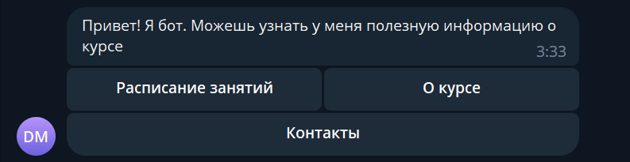

## **Теория**

### **Кнопки**

Кнопки в телеграме представляют собой список списков кнопок. Каждый список кнопок представляет собой строку кнопок. 

```python
KEYBOARD = [
    [
        InlineKeyboardButton(text="Расписание занятий", callback_data="schedule"),
        InlineKeyboardButton(text="О курсе", callback_data="course_info"),
    ],
    [InlineKeyboardButton(text="Контакты", callback_data="contacts")],
]
```
Каждая кнопка это объект класса `telegram.InlineKeyboardButton`, создаваемый при помощи 2ух обязательных параметров: `text` и `callback_data`. 

Объект - просто умное слово для переменной с несколькими параметрами (как у нас, `text` и `callback_data`)

> На самом деле это немного сложнее, но для понимания происходящего в нашем случае, этого достаточно

С полем `text` все понятно: это текст, который будет написан на кнопке. А вот с полем `callback_data` все не так просто.

`callback_data` - это то, что будет передано боту при нажатии на кнопку. В примере ниже, при нажатии на кнопку `Кнопка 1`, боту будет передано `button1`, при нажатии на кнопку `Кнопка 2`, боту будет передано `button2` и т.д. Это понадобится нам, чтобы мы могли понимать какую кнопку нажал пользователь и в зависимости от этого выполнять разные действия.



### **InlineKeyboardMarkup**

Помните созданный список списков из кнопок? Телеграм не умеет работать с этим списком напрямую, поэтому его нужно обернуть в еще один класс - `telegram.InlineKeyboardMarkup`. 

```python
reply_markup = InlineKeyboardMarkup(keyboard)
```

### **Отправка сообщений с кнопками**

Для отправки сообщений с кнопками, воспользуемся полем `reply_markup`, куда передадим наш список списков кнопок.

```python
async def start_command(update: Update, context: ContextTypes.DEFAULT_TYPE):
    await update.effective_chat.send_message(
        text="Привет! Я бот. Можешь узнать у меня полезную информацию о курсе",
        reply_markup=InlineKeyboardMarkup(KEYBOARD),
    )
```

Однако отправка кнопок еще не даст нам возможности обрабатывать нажатия на кнопки. Для этого нам нужно добавить обработчик нажатий на кнопки.

### **Обработчик нажатий на кнопки**

Для обработки нажатий на кнопки, нам понадобится создать функцию, которая будет вызываться при нажатии на кнопку. 

```python
async def callback_handler(update: Update, context: ContextTypes.DEFAULT_TYPE):
    action = update.callback_query.data

    match action:
        case "schedule":
            await update.effective_chat.send_photo(
                caption="Текущее расписание занятий",
                photo="static/schedule.png"
            )
        case "course_info":
            await update.effective_chat.send_document(
                caption="Учебный план курса",
                document="static/syllabus.txt"
            )
        case "contacts":
            await update.effective_chat.send_message(
                text="Контакты преподавателей\nAndrei Markov @markovav_official"
            )
    
    await update.callback_query.answer()
```

Здесь многое можно обсудить, но давайте разберемся по порядку.

1. Мы получаем из объекта `update` поле `callback_query.data`. Это поле содержит в себе то, что мы передали в `callback_data` при создании кнопки. В нашем случае, это должно быть что-то из `schedule`, `course_info` или `contacts`.
2. Далее мы используем `match` для обработки разных значений `action`. Оператор `match` это по сути умный `if`, который позволяет нам сравнивать значение переменной с разными значениями. Если совпадение найдено, то выполняется соответствующий блок кода.
   - Если `action` равно `schedule`, то мы отправляем фото с расписанием 
   - Если `action` равно `course_info`, то мы отправляем документ с учебным планом
   - Если `action` равно `contacts`, то мы отправляем сообщение с контактами преподавателей.
3. В конце мы отправляем ответ на нажатие на кнопку строкой `await update.callback_query.answer()`. Это нужно для того, чтобы телеграм понимал, что нажатие на кнопку было обработано.

### **Добавление обработчика нажатий на кнопки**

Для того, чтобы телеграм понимал, что нажатие на кнопку нужно обрабатывать, нужно добавить обработчик нажатий на кнопки.

```python
application.add_handler(CallbackQueryHandler(callback_handler))
```

### **Запуск бота**

Для запуска бота нужно выполнить команду

```shell
python 05-help-bot.py
```

После запуска бота, на команду `/start` он будет отправлять кнопки *Расписание занятий*, *О курсе* и *Контакты*, при нажатии на которые отправлять соответствующие сообщения.

## **Задание:**

- В файле `05-help-bot.py`

- Добавьте еще 2 кнопки:
  - *Картинка с котиком* - отправляет фото с котиком `https://http.cat/200`
  - *Получить код бота* - отправляет код бота `05-help-bot.py` как документ

## Ожидаемый результат:

При запуске команды

```shell
python 05-help-bot.py
```

При нажатии на кнопку *Картинка с котиком*, бот должен отправить фото с котиком `https://http.cat/200`
При нажатии на кнопку *Получить код бота*, бот должен отправить код бота `05-help-bot.py` как документ

## **Задание со звездочкой:**

- В файле `05-help-bot.py`

- Добавьте кнопку *Получить код бота как сообщение* - отправляет код бота `05-help-bot.py` как сообщение (не файлом)

## Ожидаемый результат:

При запуске команды

```shell
python 05-help-bot.py
```

При нажатии на кнопку *Получить код бота как сообщение*, бот должен отправить код бота `05-help-bot.py` текстом.